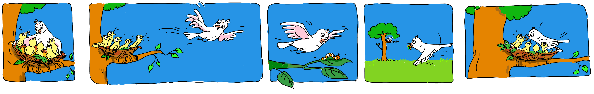

## Eyantra 2018 

> Hungry Bird theme

> 

Birds take care of their young when they hatch. Newly born chicks depend on their parents to bring them food and require feeding every half-an-hour. Knowing this, we can now appreciate the diligence of the parent birds. They go from their nest to a food source, carry it in their beaks and go back to their nest to feed their young. In fact, many birds that eat seeds, will switch to insects during the breeding season. Parents eat smaller insects themselves and take the larger ones back to the nest for the babies. This allows them to carry more food less frequently to their ever-hungry offspring. This process continues at least until the baby birds’ feathers and muscles have developed sufficiently for flight. 

Navigating in 3-D space is a task that is routinely but extremely challenging, and their proficiency at this is worth not only marveling at but also emulating! In this theme contestants are given a drone which seeks to emulate the 3-D navigation ability of the avian species. The drone performs a task routinely performed by most birds, namely going through the process of feeding itself and its young, and henceforth this theme is called Hungry Bird and the drone is referred to as “Bird”. Through this theme, we help you learn control system design and controlling a drone using the Virtual Robot Experimentation Platform(V-REP).

## Task Videos
 - Task 1
    - 1 A 
    
    
    - 1 B 

    
- Task 3
   
    

- Progress Task
   
   

- Final Task

    - College exams sucks 😕

## Team
- [Aniket Sharma ☠️](https://github.com/aniket965)
- [Ujjwal Uphdayay ⚽️](https://github.com/Ujjwal-9)
- [Vansh Obeori 🐄](https://github.com/vanshoberoi)
- [Vipassana Gautam 💁🏻‍♀️ ](https://github.com/vipassna)
